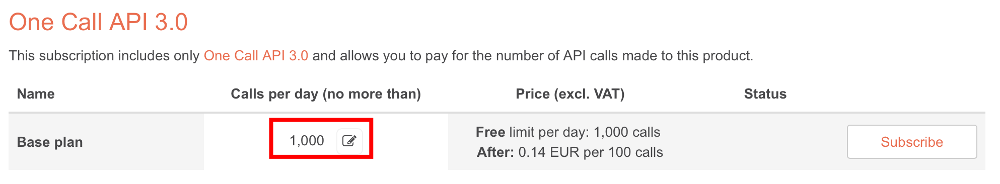

# OFM-InternetWeatherModule

Dies ist ein Modul zur Integration von Internet Wetterdiensten.

## Abhängigkeiten

Das Modul setzt [OFM-Network](https://github.com/OpenKNX/OFM-Network) oder [OFM-WLAN](https://github.com/mgeramb/OFM-WLANModule) voraus.

## Features

- Aktuelle Werte
- Prognose Heute
- Prognose Morgen
- Prognose Umschaltbar Heute/Morgen
- Prognose nächste Stunde
- Prognose übernächste Stunde

KO's für
- Wetterbeschreibung
- Tagestemperatur
- Nachttemperatur
- Frühtemperatur
- Abendtemperatur
- Minimum Temperatur
- Maximum Temperatur
- Gefühlte Tagestemperatur
- Gefühlte Nachtemperatur
- Gefühlte Frühtemperatur
- Gefühlte Abendtemperatur
- Luftdruck
- Luftfeuchte
- Wind
- Windböen
- Windrichtung
- Regen
- Schnee
- Niederschlagswahrscheinlichkeit
- UV-Index
- Wolken

## Hardware Unterstützung

|Prozessor | Status | Anmerkung                  |
|----------|--------|----------------------------|
|RP2040    | Beta   |                            |
|ESP32     | Beta   |                            |

Getestete Hardware:
- [OpenKNX Reg1-ETH](https://github.com/OpenKNX/OpenKNX/wiki/REG1-Eth)
- Adafruit ESP32 Feather V2

## Einbindung in die Anwendung

In das Anwendungs XML muss OFM-Network (oder OFM-WLAN) und das OFM-InternetWeatherModule aufgenommen werden:

```xml
  <op:define prefix="NET" ModuleType="11" 
    share="../lib/OFM-Network/src/Network.share.xml">
    <op:verify File="../lib/OFM-Network/library.json" ModuleVersion="2" /> 
  </op:define>

  <op:define prefix="IW" ModuleType="21"
    share=   "../lib/OFM-InternetWeatherModule/src/InternetWeatherModule.share.xml"
    template="../lib/OFM-InternetWeatherModule/src/InternetWeatherModule.templ.xml"
    NumChannels="5"
    KoSingleOffset="400"
    KoOffset="410">
    <op:verify File="../lib/OFM-InternetWeatherModule/library.json" ModuleVersion="0.1" /> 
  </op:define>
```

**Hinweis:** Pro Kanal werden 102 KO's benötigt. Dies muss bei nachfolgenden Modulen bei KoOffset und KoSingleOffset entsprechend berücksichtigt werden.

In main.cpp muss das ebenfalls das Network- (oder WLAN-) und InternetWeatherModule hinzugefügt werden:

```
[...]
#include "NetworkModule.h"
#include "InternetWeatherModule.h"
[...]

void setup()
{
    [...]
    openknx.addModule(1, openknxNetwork);
    openknx.addModule(3, openknxInternetWeatherModule);
    [...]
}
```

## Wetterdienste

Derzeit wird nur OpenWeatherMap als Wetteranbieter unterstützt. 
Die SW-Architektur ist aber für weitere Dienste vorbereitet.
Pull Requests für andere Dienste sind willkommen!

### OpenWeatherMap [https://openweathermap.org](https://openweathermap.org)

Für die Anfragen wird ein API Key von openwheatermap.com benötigt.
1000 Aufrufe pro Tag können gratis durchgeführt werden, jedoch muss auch dafür ein Account angelegt werden und die Subscription für das `One Call API 3.0` aktiviert werden. 
Bei der Subscription sollte das `Call per day limit` auf 1000 eingestellt werden, damit keine Kosten anfallen können.



Siehe https://openweathermap.org/price

## Lizenz

[GNU GPL v3](LICENSE)